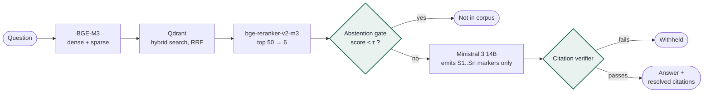

# Audit-Grade RAG for Engineering Standards

**Ask a question about a design, test or qualification requirement. Get an answer cited to document, clause and page — or a clear statement that the corpus does not contain it.**

A fully local retrieval-augmented generation system for engineering standards, built to run on a single Windows workstation with a 16 GB GPU. No cloud services, no API keys to a model provider, no document leaves the machine.

---

## Why this exists

Most RAG systems are built to sound helpful. For an engineer checking a qualification requirement, a fluent answer with a page number two digits off is worse than no answer at all, because a specific citation invites trust and gets copied into a compliance matrix.

This system is built around a different goal:

> Nothing is asserted that is not traceable to a retrieved passage, and when the corpus does not contain the answer, the system says so.

A system that answers well but occasionally invents is not 90% useful. It is unusable, because the engineer cannot tell which case they are in. A system that reliably says *"not in corpus"* makes every other answer worth reading.

## What is different from a standard RAG pipeline

Most of the pipeline is the familiar pattern: parse, chunk, embed, retrieve, rerank, generate. Three components are not, and they are the reason the output can be used as evidence.



**1. The abstention gate is control flow, not a prompt.** If the best reranked passage scores below threshold, the language model is never called. There is no opportunity to confabulate because no generation happens.

**2. The model emits markers, never citations.** Passages are presented as `[S1]`, `[S2]` and the model is forbidden from writing any document number, clause number or page. The application resolves each marker against the stored metadata and renders the citation itself. Page numbers become structurally impossible to hallucinate.

**3. A deterministic verifier checks every answer.** Every sentence must carry a marker, every marker must be in range, every quotation must appear verbatim in a cited source. Failures are retried once, then withheld.

The language model's role is deliberately small: turn six already-relevant passages into a short answer to the question as asked, preserving `shall` / `should` / `may` exactly.

## Stack

| Layer | Component | Licence |
|:--|:--|:--|
| Generation | Ministral 3 14B Instruct 2512, Q4_K_M, via Ollama | Apache 2.0 |
| Embedding | BAAI BGE-M3 (dense + sparse in one model) | MIT |
| Reranking | BAAI bge-reranker-v2-m3 | Apache 2.0 |
| Vector store | Qdrant (Docker) | Apache 2.0 |
| PDF parsing | PyMuPDF, OCRmyPDF fallback | AGPL-3.0 / commercial |
| Serving | FastAPI + uvicorn, NSSM on Windows | MIT / BSD |

Everything fits in 16 GB of VRAM on a Turing-generation Quadro RTX 5000, with about 1.8 GB headroom.

## Worked example: EASA CS-25

The system was built and validated against **EASA CS-25 Amendment 27** (Large Aeroplanes), a 1,150-page specification with alphanumeric clause numbering, a two-book CS + AMC structure, small-capped headings and appendices with their own numbering schemes.

| Measure | Result |
|:--|:--|
| Chunks indexed | 2,391 |
| Median chunk | 2,136 characters |
| Content with tables | 43% of chunks |
| Clause coverage vs. EASA eRules XML | 94.3% |
| Query latency | 15–25 s, fully local |

CS-25 is freely published by EASA. The source PDF is **not** included in this repository; download it from [easa.europa.eu](https://www.easa.europa.eu/en/document-library/easy-access-rules).

## Repository layout

```
ingest/          parse, chunk, embed, upsert; diagnostics
services/        retrieval service, orchestration API, answer contract, web UI
eval/            golden-set harness, coverage check against a reference
corpus/          example document register (source PDFs are not included)
qdrant/          docker-compose for the vector store
docs/            full installation and operations guide (PDF)
```

## Getting started

The full procedure, with a checkpoint after every step, is in **[RAG-Standards-Install-Guide-v2.pdf](RAG-Standards-Install-Guide-v2.pdf)**. In outline:

1. Prepare the host: NVIDIA driver, Python 3.11, Docker Desktop, Ollama.
2. Start Qdrant from `qdrant/` on a named Docker volume.
3. Pull the model and create the serving profile: `ollama create std-rag -f services/Modelfile`
4. Install dependencies (`requirements.txt`, PyTorch from the CUDA 12.1 index) and start `services/retrieval_svc.py`.
5. Copy `corpus/registry.example.yaml` to `registry.yaml`, add your documents, and run `ingest/index.py --dry-run`, then the real ingest.
6. Start `services/rag_api.py` and open `http://127.0.0.1:8080`.
7. Build a golden set from `eval/golden.example.yaml` and run `eval/run_eval.py` before trusting any answer.

Scripts default to paths under `C:\rag\`. All of them read their configuration from environment variables; none contain credentials.

## Adapting to another corpus

Every publisher has its own house style for headings, and the parser has to be taught each one. `ingest/probe_heading.py` shows exactly why a heading on a given page was or was not recognised. Chapter 10 of the guide walks through the five problems CS-25 required solving, as a template for ECSS, MIL-STD, ISO or an internal specification.

## Known limitations

- **Figures are not read.** Graphs, envelopes and diagrams are images; a question whose answer is a curve returns *not in corpus*.
- **No inference beyond the text.** The answer contract forbids it by design.
- **Coverage is measured, not assumed.** A clause the parser missed is invisible from inside the system, which is why `eval/xml_coverage.py` exists.

## Licensing notes

PyMuPDF is licensed under AGPL-3.0 or a commercial licence from Artifex. If you deploy this system so that other people reach it over a network, review the AGPL obligations or obtain a commercial licence.

Standards documents are usually copyrighted and licensed per seat or site. Check that your licence permits loading full text into a searchable index before ingesting anything other than freely published material.

## License

See [LICENSE](LICENSE).
